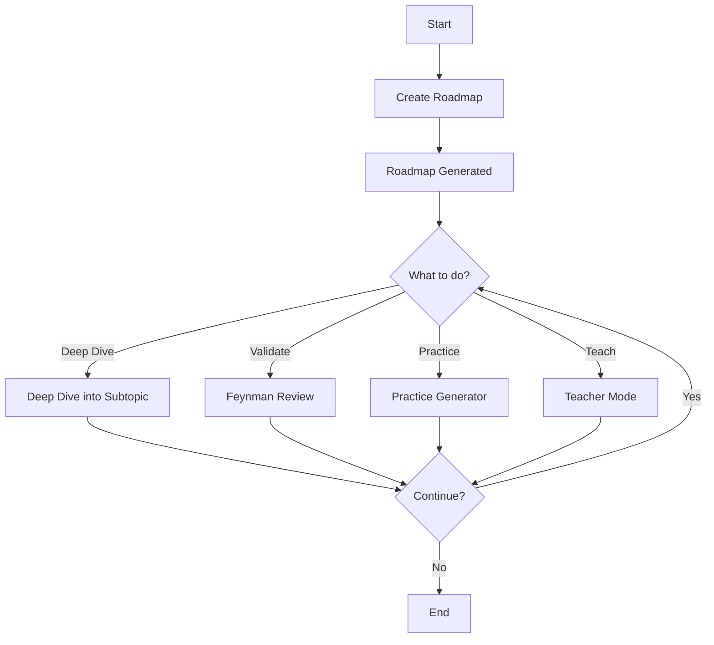

# Adaptive Learning Skill

Complete modular adaptive learning system that transforms the learning process into an iterative cycle: **planning → deep dive → validation → practice**.

## 🎯 Purpose

This skill centralizes a proven learning methodology that combines:
- Creating personalized roadmaps with 3-level structure
- Interactive deep diving through progressive questions
- Knowledge validation using the Feynman Technique
- Generating contextualized practical activities
- Guided teaching with adaptive depth levels

## 📁 Structure

```
adaptive-learning/
├── SKILL.md                          # Main router and decision logic
├── workflows/
│   ├── 01_roadmap_builder.md        # Create learning plans
│   ├── 02_deep_dive.md              # Deep dive into subtopics
│   ├── 03_feynman_review.md         # Validate understanding
│   ├── 04_practice_generator.md     # Generate practical activities
│   └── 05_teacher_mode.md           # Guided teaching with adaptive depth
├── templates/
│   ├── roadmap_template.md          # Roadmap output structure
│   ├── feynman_report_template.md   # Feynman report structure
│   └── practice_activity_template.md # Practical activity structure
└── README.md                         # This file
```

## 🚀 How to Use

### Automatic Activation

Claude will automatically activate this skill when it detects the user wants to:
- Create a learning plan ("I want to learn about X")
- Deep dive into a topic ("dive deeper into Y")
- Validate understanding ("review my knowledge")
- Generate practice ("I need an activity about Z")
- Get taught ("teach me about X", "be my professor")

### Explicit Usage

You can also activate it explicitly by mentioning:
- "Use the adaptive learning skill"
- "Help me with my learning of [topic]"
- "I want to use the learning system"

## 📚 The 5 Workflows

### 1. 🗺️ Roadmap Builder

**When to use:** You want to create a structured learning plan for a new topic.

**Process:**
- 6 rounds of questions (14 questions total)
- Captures context, level, objectives, constraints
- Generates roadmap with 3 progression levels
- Includes practical projects and Feynman technique

**Output:** `<topic>_learning_plan.md`

**Example usage:**
```
User: "I want to learn about Kubernetes from scratch"
→ Claude activates Roadmap Builder
→ Asks 14 interactive questions
→ Generates personalized Kubernetes_learning_plan.md
```

---

### 2. 🔍 Deep Dive Learning

**When to use:** You have a roadmap and want to deep dive into a specific subtopic.

**Process:**
- Reads existing roadmap
- Identifies subtopic to explore
- Generates progressive questions without limit
- Builds knowledge iteratively

**Output:** Interactive deep conversation

**Example usage:**
```
User: "I have a roadmap in ~/learning/k8s_plan.md and want to deep dive into Pods"
→ Claude reads the roadmap
→ Identifies the Pods section
→ Asks progressive questions (fundamentals → application → edge cases)
→ Continues until the user decides to stop
```

---

### 3. 📖 Feynman Review

**When to use:** You want to validate your understanding of something you learned.

**Process:**
- User explains the concept in their own words
- Claude analyzes: missing concepts, errors, confusing points, strengths
- Generates detailed report with constructive feedback
- Provides specific recommendations

**Output:** Feynman Report (terminal and/or markdown)

**Example usage:**
```
User: "I want you to review my understanding of RAG"
→ Claude asks you to explain RAG
→ User: "RAG is when you search for relevant information and pass it to the LLM..."
→ Claude analyzes the explanation
→ Generates report with score, gaps, errors, recommendations
```

---

### 4. 💪 Practice Generator

**When to use:** You need a practical activity to apply knowledge.

**Process:**
- Reads existing roadmap
- Identifies subtopic to practice
- Determines activity type (code/theoretical/case/mix)
- Generates detailed activity with steps, criteria, resources

**Output:** `<subtopic>_practice_activity.md`

**Example usage:**
```
User: "I need a practical activity on RAG from my roadmap in ~/ai_plan.md"
→ Claude reads roadmap
→ Identifies RAG concept (Level 2)
→ Generates hands-on activity: "Implement basic RAG system"
→ Includes: setup, detailed steps, tests, success criteria
```

---

### 5. 👨‍🏫 Teacher Mode

**When to use:** You want a professor to explain topics from your roadmap with adaptive depth levels.

**Process:**
- Reads existing roadmap
- Proactively identifies available topics (or lets you choose)
- Adapts explanations to 3 depth levels: Basic, Intermediate, Ultra Expert
- Provides related learning paths after each lesson
- Allows unlimited follow-up questions

**Output:** Interactive teaching session

**Example usage:**
```
User: "Teach me about the topics in my roadmap at ~/AI_learning_plan.md"
→ Claude reads roadmap
→ Asks which topic you want to learn
→ Asks what depth level you prefer
→ Explains the topic pedagogically
→ Offers related topics or Q&A mode
→ Continues teaching new topics until you exit
```

---

## 🔄 Typical Usage Flow



**Complete cycle example:**

1. **Day 1:** Create roadmap about AI Agents
2. **Day 2-3:** Teacher Mode → Learn "LLMs 101" (Basic level)
3. **Day 4-5:** Deep Dive into "LLMs 101" → Study advanced concepts
4. **Day 6:** Feynman Review → Validate understanding
5. **Day 7-8:** Teacher Mode → Learn "RAG" (Intermediate level)
6. **Day 9:** Practice Generator → Complete practical activity on RAG
7. ... cycle continues ...

## 💡 Methodology Principles

### 1. Feynman Technique
> "If you can't explain something simply, you don't understand it completely."

The skill integrates the Feynman Technique at every level:
- Explain concepts in your own words
- Identify gaps in understanding
- Simplify to the essence
- Teach others to consolidate

### 2. Active Learning
The user builds knowledge by:
- Explaining (not just consuming)
- Applying (practical projects)
- Iterating (deep dive → validate → practice)

### 3. Deep Personalization
Each output adapts to:
- Application context (work, personal, academic)
- Current level and previous experience
- Measurable final objectives
- Technological constraints
- Learning style (practical, theoretical, mixed)

### 4. Structured Progression
Roadmaps with 3 clear levels:
- **Level 1 (Beginner):** Essential fundamentals
- **Level 2 (Intermediate):** Deep application
- **Level 3 (Advanced):** Specialization and mastery

## 🛠️ Required Tools

The skill uses:
- **`AskUserQuestion`** (preferred) - For structured interactive questions
- **`file_read`** - To read workflows, templates, roadmaps
- **`file_create`** - To generate roadmaps, reports, activities
- **`view`** - To visualize files when necessary

## 📍 Generated Files Location

By default, files are saved in the **current directory** where Claude Code is executed.

If not possible, Claude will ask the user where to save.

**Typical generated files:**
- `<topic>_learning_plan.md` (Roadmap Builder)
- `<topic>_feynman_feedback.md` (Feynman Review - optional)
- `<subtopic>_practice_activity.md` (Practice Generator)

## ✨ Use Cases

### For Students
- Create study plan for a subject
- Exam preparation
- Deep dive into specific topics before assessments
- Validate real understanding vs. memorization

### For Professionals
- Upskilling in new technologies
- Preparation for role change
- Specialization in a domain
- Practical application in work context

### For Self-Learners
- Structure learning without instructor
- Validate understanding without teacher
- Generate relevant practical projects
- Maintain motivation with clear objectives

### For Instructors
- Create structured course plans
- Generate activities for students
- Evaluate deep understanding
- Identify common gaps

## 📊 Success Metrics

A successful skill implementation is verified when:

✅ **Generated roadmaps:**
- Are personalized (not generic)
- Include relevant practical projects
- Integrate Feynman technique at each level
- Have clear measurable objectives

✅ **Deep Dive works:**
- Questions are progressive and contextual
- Build on previous answers
- Explore multiple facets of the concept
- User gains deep understanding

✅ **Feynman Review is useful:**
- Identifies real specific gaps
- Feedback is constructive and actionable
- Recognizes user strengths
- Provides clear next step

✅ **Practical activities:**
- Are completable in estimated time
- Are well structured with clear steps
- Success criteria are measurable
- User can apply knowledge

## 🔧 Maintenance

### When to Update

This skill should be reviewed/updated when:
- Improvements to existing workflows are identified
- New workflows are added
- Templates are updated
- Users report confusion or issues
- Claude capabilities change (new tools)

### Modular Structure

The modular architecture facilitates maintenance:
- Each workflow is independent
- Templates can be updated without affecting logic
- Easy to add new workflows
- SKILL.md acts as central router

## 🐛 Troubleshooting

### Problem: Roadmap too generic
**Cause:** Questions didn't capture enough context
**Solution:** Ensure all 14 questions are answered completely

### Problem: Deep Dive doesn't go deep
**Cause:** Questions are not progressive
**Solution:** Each question must build on the previous answer

### Problem: Feynman Review superficial
**Cause:** User explained too briefly
**Solution:** Ask user to expand their explanation

### Problem: Practical activity too difficult
**Cause:** Didn't consider the concept level
**Solution:** Adjust complexity according to Level 1/2/3 from roadmap

## 📝 Version Notes

### v1.0 (November 2024)
- Initial release
- 4 complete workflows: Roadmap Builder, Deep Dive, Feynman Review, Practice Generator
- 3 templates: roadmap, feynman_report, practice_activity
- Fully functional modular system

## 🤝 Contributions

To improve this skill:
1. Identify area for improvement
2. Document the problem clearly
3. Propose specific solution
4. Update corresponding workflow/template
5. Update this README if necessary

## 📧 Version

**Creation date:** November 2024
**Version:** 1.0

---

## 🎓 Design Philosophy

This skill is based on the belief that:

> **Effective learning is not passive consumption, but active construction of knowledge.**

That's why:
- User explains (not just reads)
- User applies (not just understands)
- User validates (not just assumes)
- User iterates (not just completes)

The goal is not to "finish a course" but to **truly master the knowledge**.

---

**Ready to learn more effectively? Start by creating your first roadmap.**
