# 🎯 Learning Roadmap: [TOPIC]

**IMPORTANT: This roadmap will be generated in the same language the user requested it in.**

## Learning Profile

- **Topic:** [Exact topic specified by user]
- **Scope:** [Specific scope within the topic]
- **Context:** [Application context: work/personal/academic/entrepreneurship/personal development]
- **Depth:** [Superficial/Moderate/Deep/Specialization]
- **Final Objective:** [User's measurable objective]
- **Estimated Time:** [User's available time]
- **Learning Style:** [Practical/Theoretical/Learning-by-example/Mixed]

### Focus Areas
- [Selected area 1]
- [Selected area 2]
- [Selected area 3]
...

### Areas to Exclude/Deprioritize
- [Area to exclude if specified]
...

### Constraints
- [Technological or domain constraint if specified]
...

### Specific Project/Problem
[If the user has a concrete project to solve, describe it here]

### Known Resources/Tools
- [Resource or tool they already know]
...

---

## 📊 Visual Progression Diagram

```mermaid
graph TD
    A["🔰 BEGINNER<br/>Essential Fundamentals"] -->|Master| B["📚 INTERMEDIATE<br/>Deep Application"]
    B -->|Consolidate| C["🚀 ADVANCED<br/>Specialization"]

    A --> A1["[Concept 1<br/>Level 1]"]
    A --> A2["[Concept 2<br/>Level 1]"]
    A --> A3["[Concept 3<br/>Level 1]"]

    B --> B1["[Concept 1<br/>Level 2]"]
    B --> B2["[Concept 2<br/>Level 2]"]
    B --> B3["[Concept 3<br/>Level 2]"]

    C --> C1["[Concept 1<br/>Level 3]"]
    C --> C2["[Concept 2<br/>Level 3]"]
    C --> C3["[Concept 3<br/>Level 3]"]

    style A fill:#e1f5ff
    style B fill:#fff3e0
    style C fill:#e8f5e9
```



---

# 🔰 LEVEL 1: BEGINNER - Essential Fundamentals

*Estimated duration: [X weeks/months based on available time]*

**Note: All content in this section will be in the language specified by the user.**

## Concept 1: [Concept Name]

### Description
[Concept description contextualized specifically to the user's domain, NOT generic.
Should explain:
- What the concept is
- Why it's important in the user's specific context
- How it relates to the general topic and domain
- Why it's fundamental to learn it first]

### Practical Project
**Project:** "[Name of simple and relevant project]"

**Description:** [What the user will build or learn in this project]

**Estimated duration:** [X hours/days]

**Expected result:** [What they will have created/understood by completing the project]

**Steps:**
1. [Specific and actionable step 1]
2. [Specific and actionable step 2]
3. [Specific and actionable step 3]
4. [Step 4...]
...

### Feynman Technique for this Concept

**Step 1: Study**
Read/learn about [Concept] using the recommended resources. Write what you understood in your own words.

**Step 2: Teaching**
Explain this concept as if you were teaching someone completely new to the topic. Use examples from your [user's domain] context.

You can use Claude Code to practice:
```
"Explain to me as if I were completely new: [Concept in your specific domain context]"
```

**Step 3: Identify Gaps**
- Where did you get stuck while explaining?
- What parts didn't flow naturally?
- Are there concepts you mentioned without fully understanding them?

**Step 4: Review**
Study those weak areas identified and repeat step 2.

**Step 5: Simplification**
Reduce the explanation to a maximum of 3 clear paragraphs:
1. [What it is and why it matters]
2. [How it works or applies]
3. [Concrete example from your domain context]

### Recommended Resources
- **[Resource type]:** [Resource name] - [URL or reference]
  - [Why this resource is useful for this concept]
- **[Resource type]:** [Resource name] - [URL or reference]
  - [Why this resource is useful]
...

---

## Concept 2: [Concept Name]

[Repeat complete structure from Concept 1]

---

[Continue with 3-5 concepts for Level 1]

---

## ✅ Milestone: Complete Level 1

Validation that you master this level:

- [ ] I can explain the [N] Level 1 concepts in simple terms
- [ ] I completed the practical projects of Level 1
- [ ] I identified my gaps using the Feynman Technique
- [ ] I can answer [X]% of basic questions about these concepts
- [ ] [Specific additional criterion based on user's objective]

---

# 📚 LEVEL 2: INTERMEDIATE - Deep Application

*Estimated duration: [X weeks/months based on available time]*

Now that you have solid foundations, you'll start building more complex systems and applying concepts in real contexts.

## Concept 1: [Intermediate Concept Name]

### Description
[Deeper description, assuming Level 1 knowledge.
Should explain:
- How this concept builds on the fundamentals
- Why it's important in the user's advanced context
- What problems it solves that Level 1 concepts can't
- How it applies in real situations in the user's domain]

### Intermediate Practical Project
**Project:** "[Name of more complex project]"

**Description:** [Practical application in the user's specific context]

**Estimated duration:** [X days/weeks]

**Expected result:** [What they will have built upon completion]

**Prerequisites:** [Level 1 concepts necessary for this project]

**Steps:**
1. [Step 1 more complex]
2. [Step 2 that integrates multiple concepts]
3. [Step 3 that requires design decisions]
...

### Feynman Technique for Consolidation

**Step 1: Deep Study**
[Similar to Level 1, but with greater depth and connections between concepts]

**Step 2: Contextualized Teaching**
Explain this concept by connecting it with [related Level 1 concepts] and applying it to [user's specific context].

**Step 3: Identify Advanced Gaps**
- Do you understand when to use this concept vs. alternatives?
- Can you explain trade-offs and design decisions?
- Do you understand the limitations and cases where it doesn't apply?

**Step 4: Review and Connections**
Review not just the isolated concept, but how it integrates with the complete system.

**Step 5: Context-based Simplification**
Reduce to 3 paragraphs that someone in the [user's domain] can understand.

### Recommended Resources
- **[Intermediate resource type]:** [Name] - [URL]
  - [Why it's useful for this level]
...

---

## Concept 2: [Intermediate Concept Name]

[Repeat complete structure]

---

[Continue with 4-6 concepts for Level 2]

---

## ✅ Milestone: Complete Level 2

Validation of mastery:

- [ ] I can apply the concepts in new situations
- [ ] I completed the more complex projects
- [ ] I understand the connections between Level 1 and Level 2 concepts
- [ ] I can teach these concepts to someone at Level 1
- [ ] [Specific additional criterion based on user's objective]

---

# 🚀 LEVEL 3: ADVANCED - Specialization and Mastery

**IMPORTANT: Language Adaptation** - This entire section will be generated in the same language the user requested the roadmap in.

*Estimated duration: [X weeks/months based on available time]*

At this level, you deepen into real specialization and completely master the [user's specific area].

## Concept 1: [Name of Specialized Concept]

### Description
[Specialized description in the sub-area chosen by the user.
Should explain:
- Why this concept represents specialization
- How it integrates everything you learned in Levels 1 and 2
- What complex real-world problems in your context it solves
- Why it's critical for reaching your final objective]

### Integrating Project
**Project:** "[Name of complex project that integrates multiple concepts]"

**Description:** [Real solution to a problem in your area]

**Estimated duration:** [X weeks/months]

**Expected result:** [What you will have achieved - must align with final objective]

**Integrates:** [List of Level 1 and Level 2 concepts this project applies]

**Steps:**
1. [Step 1 requiring architectural design]
2. [Step 2 integrating multiple systems]
3. [Step 3 optimizing and scaling]
4. [Step 4 validating in production or real context]
...

### Feynman Technique for Mastery

**Step 1: Expert Teaching**
Document a complete guide about this concept as if you were an expert in your field. The guide should be sufficient for another professional to learn from it.

**Step 2: Content Creation**
Create an explanation (blog post, video, presentation) that someone can understand without deep prior knowledge of the topic.

**Step 3: External Validation**
Can someone who doesn't know the topic deeply understand your explanation? Ask for real feedback.

**Step 4: Application to New Contexts**
Can you apply this concept to problems you've never seen before? Practice with new cases.

**Step 5: Teaching Others**
True mastery comes from teaching. Consider sharing your knowledge with others in your field.

### Advanced Resources
- **[Type of advanced resource]:** [Name] - [URL]
  - [Why it's critical for specialization]
...

---

## Concept 2: [Name of Specialized Concept]

[Repeat complete structure]

---

[Continue with 3-4 specialized concepts for Level 3]

---

## ✅ Milestone: Achieve Mastery (Level 3 Complete)

Final validation:

- [ ] I completed the integrating project
- [ ] I can document and explain these concepts to anyone
- [ ] I recognize patterns and real-world use cases
- [ ] I can solve new problems using this knowledge
- [ ] I could teach this topic to others
- [ ] [I achieved the specified final objective: user's objective]

---

# 📖 How to Use the Feynman Technique with Claude Code

**IMPORTANT: Language Adaptation** - All guidance below uses English examples, but when applying these techniques, respond in the language you are learning in.

The Feynman Technique is your compass for validating real understanding. Here's how to use it integrated into your learning process:

## Stage 1: Learning (Content Consumption)
- Read books, documentation, tutorials from the recommended resources
- Take notes: What did I understand? What didn't I?
- **Prompt for Claude Code (adapt to your language):**
  ```
  I have these doubts about [Concept]:
  - [Doubt 1]
  - [Doubt 2]
  Explain it to me in the context of [your specific area].
  ```

## Stage 2: Teaching (Understanding Validation)
- Explain the concept as if you were teaching someone completely new
- **Prompt for Claude Code (adapt to your language):**
  ```
  Explain in simple terms how [Concept] would work in the context of [your specific application].
  Don't use jargon. Pretend my audience is [profile of your audience].
  ```
- If you can't explain something without confusion, that's a gap

## Stage 3: Gap Identification
- Note exactly where your explanation breaks down
- Study those specific parts again
- **Prompt for Claude Code (adapt to your language):**
  ```
  I don't completely understand [specific part]. Explain it to me another way.
  Use analogies with [concept you already know well].
  ```

## Stage 4: Simplification
- Reduce each concept to its essence in a maximum of 3 paragraphs
- It should be understandable to someone in your field without deep prior knowledge

## Stage 5: Practical Application
- Implement what you learned in the practical projects in the roadmap
- **Suggested command (if you use Claude Code):**
  ```
  /impl:tdd-implement [description of practical project]
  ```
- This forces you to really apply the knowledge

## Stage 6: Teaching Others (Mastery)
- Create documentation or guides that others can follow
- Answer questions about the topic in your professional/academic context
- Share your knowledge

---

# ✅ Validation Plan - How Do I Know I Master Each Level?

## Milestone: Complete Level 1 ✓

### Requirements
- [ ] I can explain Level 1 concepts in simple terms without looking at references
- [ ] I completed at least [N] of the [M] practical projects in Level 1
- [ ] I identified and resolved my gaps using Feynman
- [ ] I can answer the following questions without googling:
  - [Key question 1 about the topic]
  - [Key question 2 about the topic]
  - [Key question 3 about the topic]

### Self-Test
Explain these concepts without references:
1. [Fundamental concept 1]
2. [Fundamental concept 2]
3. [Fundamental concept 3]

If you could explain with clarity → **Ready for Level 2**

---

## Milestone: Complete Level 2 ✓

### Requirements
- [ ] I can apply the concepts in new situations I haven't seen before
- [ ] I completed at least [N] of the [M] projects in Level 2
- [ ] I understand the connections between Level 1 and Level 2 concepts
- [ ] I can design solutions for problems in [your context]
- [ ] [Specific criterion based on your objective]

### Self-Test
- Design a solution for [specific problem in your area] using the concepts learned
- Explain why you chose [concept X] instead of [concept Y]
- Describe the trade-offs of your design

If you can design architectures and justify decisions → **Ready for Level 3**

---

## Milestone: Achieve Level 3 (Mastery) ✓

### Requirements
- [ ] I completed the integrating project
- [ ] I can document and teach advanced concepts to others
- [ ] I recognize trade-offs and know when to use each pattern
- [ ] I've solved a real problem using this knowledge
- [ ] [I achieved the final objective: your specific objective]

### Self-Test
- Receive a new problem from your field and design the complete solution
- Implement a prototype in [reasonable time]
- Document decisions and trade-offs
- Identify optimization points

If you can do this with confidence → **You Have Achieved Mastery**

---

# 📊 Final Success Metric

## Primary Objective
> [User's measurable final objective - e.g., "Get a job as [role]", "Complete [specific project]"]

## How I Know I Achieved the Objective

### Technical Mastery
- [ ] [Technical criterion 1 specific to the topic]
- [ ] [Technical criterion 2]
- [ ] [Technical criterion 3]

### Practical Application
- [ ] [Application criterion 1 related to the objective]
- [ ] [Application criterion 2]
- [ ] [Application criterion 3]

### External Validation
- [ ] [How it will be validated externally - e.g., "Passed certification", "Launched project", "Got position"]

---

# 📚 Complementary Resources

## General Resources for the Topic

### Fundamentals
- **[Type]:** [Name] - [URL]
  - [Why it's fundamental for the topic]

### Official Documentation
- **[Tool/Framework 1]:** [URL]
- **[Tool/Framework 2]:** [URL]

### Communities and Support
- [Community 1 relevant to the topic] - [URL]
- [Forum/Discord 2] - [URL]

### Newsletters and Blogs
- [Newsletter 1 in your field] - [URL]
- [Expert blog 2] - [URL]

---

# 🎯 Next Steps - Start Today

## Immediate Action (Today)
1. [Specific action 1 - 30-60 min]
2. [Specific action 2 - 30-60 min]
3. [Specific action 3 to start the first concept]

## This Week
1. Complete [Concept 1 from Level 1]
2. Start [Project 1 from Level 1]
3. Use Feynman: explain [concept] to Claude Code

## This Month
1. Complete all Level 1 concepts
2. Complete at least [N] practical projects
3. Establish solid foundation of understanding

## Next [X] Months (based on estimated time)
1. Progress to Level 2
2. Build more complex projects
3. Apply knowledge in [your context]

## [Total estimated time]
1. Master Level 3
2. Specialize in [your specific area]
3. [Achieve your final objective]

---

# 💡 Final Tips for Your Success

1. **Avoid Tutorial Hell:** Don't consume content indefinitely. BUILD after learning basic concepts.

2. **Use Feynman Religiously:** If you can't explain something in simple terms, you don't completely understand it.

3. **Keep Code/Projects Simple:** Complexity emerges naturally. Start with the simplest possible approach.

4. **Iterate Fast:** Better to have something functional and basic than a perfect design that doesn't exist.

5. **[Specific tip about the topic 1]**

6. **[Specific tip about your field]**

7. **Contribute:** Once you gain confidence, contribute to open-source projects or share your knowledge.

8. **Stay Updated:** [How to stay updated in this specific topic]

---

**Created:** [Creation date]
**Recommended next review:** [Future date - the field evolves]
**Version:** 1.0
