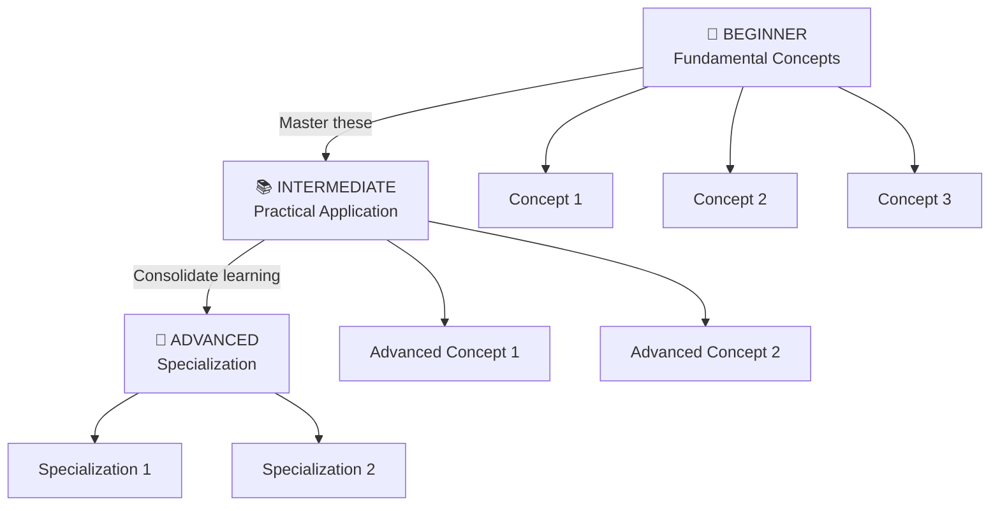

# Context:
This command uses a comprehensive 6-round questioning system to understand exactly what you want to learn, in what context you'll apply it, at what depth, and what your specific constraints and preferences are.

With this captured information, it generates an ultra-personalized roadmap with 3 progression levels (Beginner → Intermediate → Advanced), where each concept includes:
- Description contextualized to the user's domain
- Practical project for immediate application
- Specific Feynman tips to validate understanding
- Recommended resources adapted to context

# Task:

## Phase 1: Information Gathering (6 Rounds with AskUserQuestion)

### Round 1: Topic, Context and Domain (3 questions)

Use the AskUserQuestion tool with the following 3 questions:

1. **"What topic or concept do you want to master?"**
   - Type: Open input (no predefined options)
   - Example: "Machine Learning", "System Design", "React", etc.

2. **"In what main context will you apply this knowledge?"**
   - Type: Single-select
   - Options:
     * Work/Professional
     * Personal project
     * Academic/Certification
     * Entrepreneurship
     * Curiosity/Personal development

3. **"Is there a specific area within this topic?"**
   - Type: Open input
   - Example: "If Machine Learning: NLP, Computer Vision, Forecasting, Reinforcement Learning"
   - Example: "If JavaScript: Frontend, Backend, Full-Stack"

---

### Round 2: Current Level and Experience (2 questions)

Use AskUserQuestion with:

4. **"What is your current level in this topic?"**
   - Type: Single-select
   - Options:
     * No prior knowledge
     * Basic knowledge
     * Intermediate level
     * Advanced level (I want specialization)

5. **"Do you have experience in related fields?"**
   - Type: Single-select
   - Options:
     * No, it's completely new to me
     * Yes, I have experience in [specify field]
     * Yes, I have experience in multiple related fields

---

### Round 3: Depth and Scope (3 questions)

Use AskUserQuestion with:

6. **"What depth of knowledge are you looking for?"**
   - Type: Single-select
   - Options:
     * Superficial (understand general concepts)
     * Moderate (functional practical application)
     * Deep (complete technical mastery)
     * Specialization (become an expert in a sub-area)

7. **"What specific areas of the topic interest you most?"**
   - Type: Multi-select (user can select several)
   - Options:
     * Theoretical foundations
     * Practical application
     * Real-world use cases
     * Tools and frameworks
     * Patterns and best practices
     * Performance and optimization
     * Security
     * Scalability

8. **"Are there areas you want to exclude or deprioritize?"**
   - Type: Open input
   - Example: "I'm not interested in pure theoretical aspects"
   - Example: "Deprioritize performance topics"

---

### Round 4: Specific Application Context (2 questions)

Use AskUserQuestion with:

9. **"Do you have a specific project, role, or problem you want to solve?"**
   - Type: Open input
   - Example: "I want to build a REST API for my startup"
   - Example: "I need to optimize queries in an existing database"

10. **"Are there technological or domain constraints I should know about?"**
    - Type: Open input
    - Example: "Only open-source technologies"
    - Example: "Must be compatible with Python 3.8+"
    - Example: "Works with financial data (compliance)"

---

### Round 5: Learning Style and Time (2 questions)

Use AskUserQuestion with:

11. **"What is your preferred learning style?"**
    - Type: Single-select
    - Options:
      * Practical (hands-on, real projects from the start)
      * Theoretical (concepts and fundamentals first)
      * Learning-by-example (see how others do it)
      * Mixed (flexible depending on the stage)

12. **"How much time can you invest in this learning?"**
    - Type: Single-select
    - Options:
      * Less than 1 month (intense learning)
      * 1-3 months (moderate pace)
      * 3-6 months (deep learning)
      * 6-12 months (specialization)
      * No time limit (at my own pace)

---

### Round 6: Goals and Metrics (2 questions)

Use AskUserQuestion with:

13. **"What is your measurable end goal?"**
    - Type: Single-select
    - Options:
      * Complete a specific project
      * Pass a certification
      * Get a job/role
      * Achieve mastery level
      * Solve a specific problem
      * Teach others

14. **"Are there resources or tools you already know that you want to leverage?"**
    - Type: Multi-select
    - Options:
      * Programming languages
      * Familiar frameworks
      * Related prior concepts
      * Existing tools

---

## Phase 2: Processing and Analysis

With all responses captured from the 14 questions, perform:

1. **Create a user profile** based on:
   - Specific topic and domain
   - Application context
   - Current level and prior experience
   - Desired depth and focus areas
   - Constraints and preferences
   - Measurable end goal

2. **Design the 3-level structure** adapted to:
   - The specific context (work, personal, academic, etc.)
   - The identified domain
   - The desired depth
   - The selected focus areas
   - Available time
   - Learning style

3. **For each level, identify:**
   - Contextualized key concepts (3-6 per level)
   - Practical projects that solve domain problems
   - Specific Feynman tips to validate understanding
   - Relevant recommended resources

---

## Phase 3: Document Generation

Create a Markdown file named `<topic>_learning_plan.md` in the execution root with the following structure:

### 1. Personalized Header

```
# 🎯 Learning Roadmap: [TOPIC]

## Learning Profile
- **Topic:** [Exact topic]
- **Domain:** [Specific domain]
- **Context:** [Application context]
- **Depth:** [Desired depth]
- **End Goal:** [Measurable goal]
- **Estimated Time:** [Captured time]
- **Learning Style:** [Preferred style]

### Focus Areas
- [Area 1]
- [Area 2]
- ...

### Areas to Exclude/Deprioritize
- [If applicable]

### Constraints
- [If applicable]
```

### 2. Visual Diagram (Mermaid)

Create a flowchart showing:
- The 3 progression levels
- Key concepts at each level
- Learning flow
- Milestones and intermediate objectives

Example:


### 3. Level 1: Beginner - Contextualized Fundamentals

For each concept (3-5 total):

```
## Concept: [Name]

### Description
[Description adapted specifically to the user's domain, not generic]

### Practical Project
**Project:** [Simple and relevant project name]
**Description:** [What you'll build or learn]
**Estimated duration:** [X hours/days]
**Expected result:** [What you'll have created/understood]

**Steps:**
1. [Step 1]
2. [Step 2]
3. [Step 3]

### Feynman Technique for this Concept
1. **Study:** Read/learn about [Concept]. Write what you understood in your own words.
2. **Teaching:** Explain this concept to Claude Code (use the prompt: "Explain to me as if I were completely new to this topic: [Concept]")
3. **Identify Gaps:** Where did you get stuck explaining? What parts didn't flow naturally?
4. **Review:** Study those weak areas and repeat step 2.
5. **Simplification:** Reduce the explanation to a maximum of 3 clear paragraphs.

### Recommended Resources
- [Resource 1]
- [Resource 2]
```

### 4. Level 2: Intermediate - Deep Application

For each concept (4-6 total):

```
## Concept: [Name]

### Description
[Deeper description, assuming Level 1 knowledge]

### Intermediate Practical Project
**Project:** [More complex project name]
**Description:** [Practical application in the user's context]
**Estimated duration:** [X days/weeks]
**Expected result:** [What you'll have built]

**Prerequisites:** [Level 1 concepts needed]

**Steps:**
1. [Step 1]
2. [Step 2]
...

### Feynman Technique for Consolidation
[Similar to Level 1, but with greater depth]

### Recommended Resources
- [Resource 1]
- [Resource 2]
```

### 5. Level 3: Advanced - Specialization

For each concept (3-4 total):

```
## Concept: [Specialized Name]

### Description
[Specialized description in the user's sub-area]

### Integrating Project
**Project:** [Complex project name that integrates multiple concepts]
**Description:** [Real solution to a domain problem]
**Estimated duration:** [X weeks/months]
**Expected result:** [What you'll have achieved]

**Integrates:** [Level 1 and Level 2 concepts it applies]

**Steps:**
1. [Step 1]
2. [Step 2]
...

### Feynman Technique for Mastery
1. **Teaching:** Document a complete guide on this concept as if you were an expert.
2. **Video/Blog:** Create an explanation that someone could understand (you can use Claude Code: "/code-workflow:dev:tdd-implement" to code while teaching).
3. **Validation:** Can someone who doesn't know the topic understand your explanation?

### Advanced Resources
- [Resource 1]
- [Resource 2]
```

### 6. Integrated Feynman Guide for the Entire Journey

```
## 📖 How to Use the Feynman Technique with Claude Code

The Feynman Technique is your compass for validating real understanding. Here's how to use it at each stage:

### Stage 1: Learning (Content Consumption)
- Read books, documentation, tutorials
- Take notes: What did I understand? What didn't I?
- **Prompt for Claude:** "I have these questions about [Concept]: [list your questions]"

### Stage 2: Teaching (Understanding Validation)
- Explain the concept to Claude Code as if it were completely new
- **Prompt for Claude:** "Explain to me in simple terms how this would work in [specific context]"
- If you can't explain something, that's a gap

### Stage 3: Gap Identification
- Note exactly where the explanation fails
- Go back to study those specific parts
- **Prompt for Claude:** "I don't understand [specific part]. Explain it to me another way"

### Stage 4: Simplification
- Reduce each concept to its essence
- You can teach the concept in a maximum of 3 clear paragraphs
- **Prompt for Claude:** "Summarize [Concept] in 3 paragraphs maximum that anyone can understand"

### Stage 5: Practical Application (With /code-workflow:dev:tdd-implement)
- Implement what you learned in the practical project
- Use: `/code-workflow:dev:tdd-implement [project description]`
- This forces you to actually apply the knowledge

### Stage 6: Teaching Others (Mastery)
- Create documentation or guides that others can follow
- Answer questions about the topic
- **Suggested command:** `/project-insights:docs:architecture` to document your understanding

### Useful Commands on Your Journey
- `/code-workflow:dev:tdd-implement` - Implement projects using TDD
- `/project-insights:docs:architecture` - Document your system understanding
- `/code-workflow:qa:test` - Create tests to validate your code
```

### 7. Validation Plan and Milestones

```
## ✅ Validation Plan - How Do I Know I've Mastered Each Level?

### Milestone: Complete Level 1 ✓
- [ ] I can explain the 3-5 concepts in simple terms
- [ ] I completed the Level 1 practical projects
- [ ] I identified my gaps using Feynman
- [ ] I can answer 80% of basic questions about these concepts

### Milestone: Complete Level 2 ✓
- [ ] I can apply the concepts in new situations
- [ ] I completed the more complex projects
- [ ] I understand the connections between Level 1 and 2 concepts
- [ ] I can teach these concepts to someone at Level 1

### Milestone: Reach Level 3 (Mastery) ✓
- [ ] I completed the integrating project
- [ ] I can document and explain these concepts to anyone
- [ ] I recognize patterns and use cases in the real world
- [ ] I can solve new problems using this knowledge
- [ ] I could teach this topic to others

### Final Success Metric
**Goal:** [User's end goal - e.g., "Get a job as [role]", "Complete [project]"]
**Validation:** [How you'll know you achieved it]
```

---

## Process Summary

1. ✅ User answers 14 questions in 6 rounds
2. ✅ Create a personalized profile based on those responses
3. ✅ Design a 3-level roadmap specific to the context
4. ✅ Generate a markdown document with:
   - Visual diagram of the path
   - Contextualized concepts
   - Relevant practical projects
   - Integrated Feynman tips
   - Recommended resources
   - Clear validation plan
5. ✅ Save the file as `<topic>_learning_plan.md` in the root

---

## Important Notes

- **Contextualization is key:** This is not a generic roadmap; each concept and project must be adapted to the user's domain, context, and goal.
- **Feynman is the compass:** Each level must include specific tips on how to validate understanding.
- **Projects must serve a purpose:** They're not fictional exercises; they must solve problems or create value in the user's context.
- **Time is realistic:** The estimate must consider the user's available time.
- **Flexibility:** If the user has prior experience, the roadmap can be shorter or skip levels.
